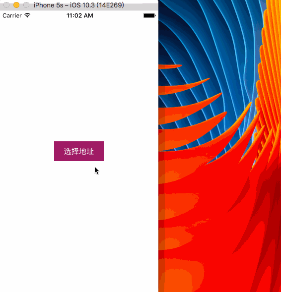
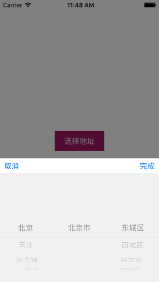
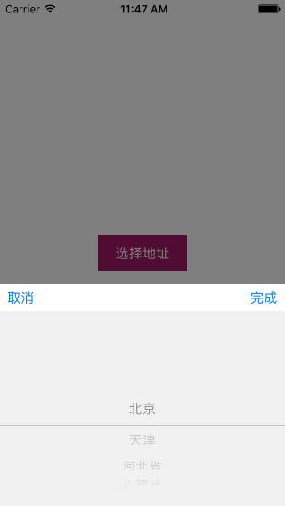
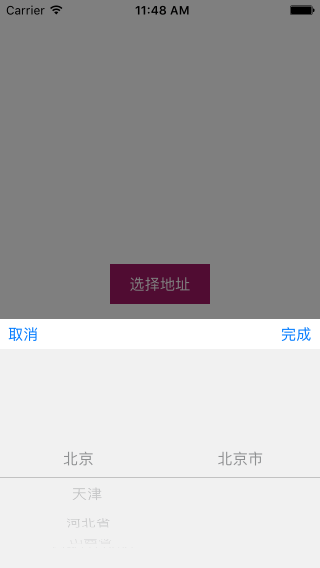

# AddressPickerDemo

[]()
[]()
[]()

中国省市区地址选择器

## Feature

- 支持iPhone & iPad
- 适配横竖屏

## Requirements

- Xcode8.0+
- iOS7.0+

## Usage

1. 将AddressPicker文件夹拖拽到项目，并导入头文件: `#import "XPAddressPicker.h"`

2. 实例化XPAddressPicker并显示

```ObjC
XPAddressPicker *picker = [[XPAddressPicker alloc] init];
picker.delegate = self;
picker.pickerStyle = XPAddressPickerStyleDefault;
// [picker setSelectionAddressForId:@"450881"];
[picker show];
```

3. 遵守`XPAddressPickerDelegate`协议，并实现`-addressPicker:didFinishPickingAddress:`方法获取回调数据

```ObjC
- (void)addressPicker:(XPAddressPicker *)picker didFinishPickingAddress:(NSDictionary<NSString *,NSDictionary *> *)info {
    NSDictionary *province = info[XPAddressPickerProvinceKey]; // 省份信息
    NSDictionary *city = info[XPAddressPickerCityKey]; // 城市信息
    NSDictionary *county = info[XPAddressPickerCountyKey]; // 市区信息
    
    NSString *provinceName = province[XPAddressPickerNameKey];
    NSString *cityName = city[XPAddressPickerNameKey];
    
    NSString *ID = city[XPAddressPickerIdKey];
    NSMutableString *string = [[NSMutableString alloc] initWithFormat:@"%@ %@", provinceName, cityName];
    if (nil != county) {
        NSString *countyName = county[XPAddressPickerNameKey];
        ID = county[XPAddressPickerIdKey];
        [string appendFormat:@" %@", countyName];
    }
    [string appendFormat:@" id:%@", ID];
    
    UIAlertView *alertView = [[UIAlertView alloc] initWithTitle:@"您选择的地址是:" message:string delegate:nil cancelButtonTitle:@"OK" otherButtonTitles:nil, nil];
    [alertView show];
}
```

## Preview



## XPAddressPickerStyle

- XPAddressPickerStyleDefault



- XPAddressPickerStyleSingle



- XPAddressPickerStyleDouble



## License

基于MIT License进行开源，详细内容请参阅`LICENSE`文件。
